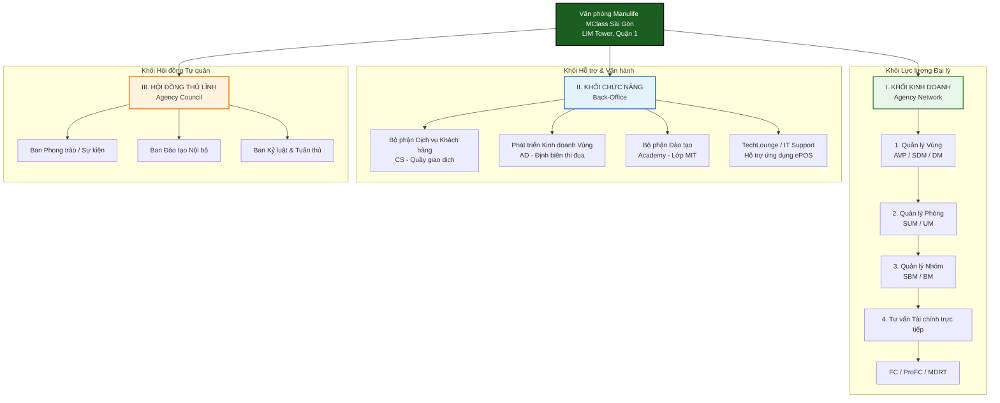
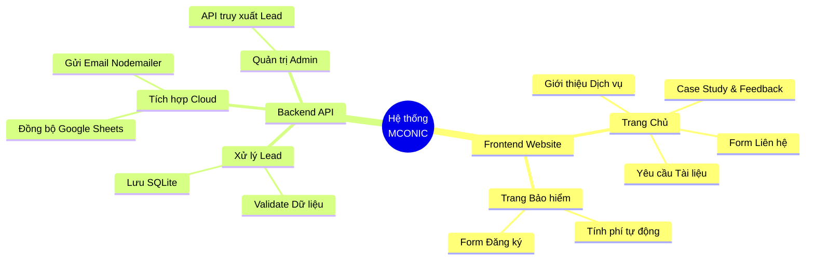
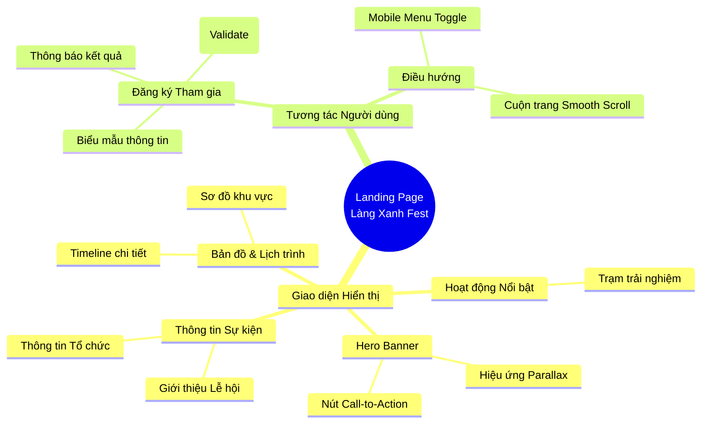
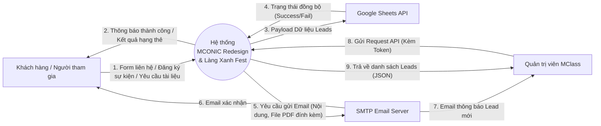
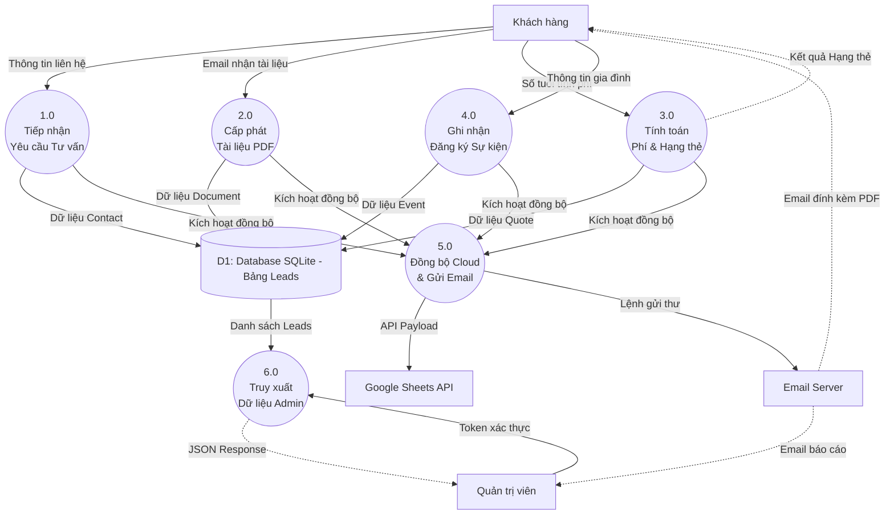
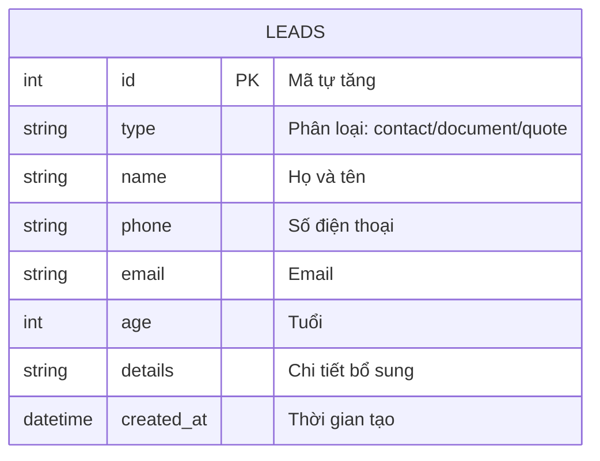

# DANH SÁCH CÁC BẢNG BIỂU VÀ HÌNH VẼ CHI TIẾT

Dưới đây là chi tiết nội dung của các bảng biểu và mã nguồn Mermaid để tạo các hình vẽ/sơ đồ. Bạn có thể sử dụng nội dung này để đưa vào báo cáo.

---

## 1. CÁC BẢNG BIỂU

### Bảng 4.1: Bảng mô tả chi tiết các luồng chức năng của hệ thống

| STT | Phân hệ | Tên chức năng | Mô tả chi tiết |
|:---:|:---|:---|:---|
| 1 | Frontend (B2B) | Form liên hệ tư vấn | Thu thập thông tin khách hàng (Tên, SĐT, Email). Validate client-side bằng Regex. Hiển thị thông báo thành công. |
| 2 | Frontend (B2B) | Đăng ký nhận tài liệu | Popup modal cho phép khách hàng chọn loại tài liệu (Profile, Checklist, Report) và nhập email để nhận file PDF. |
| 3 | Frontend (B2B) | Tính phí bảo hiểm | Công cụ JavaScript tính hạng thẻ bảo hiểm (Bạc, Titan, Vàng...) dựa trên tuổi khách hàng nhập vào. |
| 4 | Frontend (B2C) | Đăng ký tham gia sự kiện | Form đăng ký với các trường thông tin gia đình. Tích hợp đếm ngược thời gian sự kiện. |
| 5 | Backend | Xử lý API & Lưu CSDL | Tiếp nhận request từ Frontend, validate server-side, lưu dữ liệu Lead vào cơ sở dữ liệu SQLite. |
| 6 | Backend | Đồng bộ Google Sheets | Tự động ghi dữ liệu khách hàng mới lên Google Sheets theo thời gian thực qua API v4. |
| 7 | Backend | Gửi Email tự động | Sử dụng Nodemailer gửi email thông báo cho Admin và email xác nhận/đính kèm tài liệu cho khách hàng. |

### Bảng 4.2: Cấu trúc từ điển dữ liệu bảng Leads (SQLite)

| Tên trường | Kiểu dữ liệu | Ràng buộc | Mô tả |
|:---|:---|:---|:---|
| `id` | INTEGER | PRIMARY KEY, AUTOINCREMENT | Mã định danh duy nhất của khách hàng |
| `type` | TEXT | NOT NULL | Loại khách hàng (contact, document, quote, event) |
| `name` | TEXT | NOT NULL | Họ và tên khách hàng đại diện |
| `phone` | TEXT | NULL | Số điện thoại liên hệ |
| `email` | TEXT | NULL | Địa chỉ thư điện tử |
| `age` | INTEGER | NULL | Tuổi (dùng cho tính phí bảo hiểm) |
| `details` | TEXT | NULL | Thông tin bổ sung (Hạng thẻ, Tên tài liệu, Số người tham gia) |
| `created_at` | DATETIME | DEFAULT CURRENT_TIMESTAMP | Thời gian tạo bản ghi |

### Bảng 4.3: So sánh đánh giá giữa lý thuyết và thực tiễn áp dụng

| Tiêu chí | Kiến thức lý thuyết | Thực tiễn áp dụng tại doanh nghiệp |
|:---|:---|:---|
| **Kiến trúc hệ thống** | Tách biệt Client - Server hoàn toàn, giao tiếp qua RESTful API chuẩn mực. | Áp dụng đúng lý thuyết. Frontend dùng HTML/JS gọi API đến Backend Node.js. |
| **Cơ sở dữ liệu** | Phân chia thành nhiều bảng có quan hệ (1-n, n-n) theo chuẩn hóa (3NF). | Tối giản hóa thành 1 bảng `leads` duy nhất với cột `type` để tăng tốc độ triển khai MVP. |
| **Bảo mật** | Sử dụng JWT (JSON Web Token) ở header cho mọi luồng xác thực. | Dùng Query Parameter (`?token=`) cho Admin API để ưu tiên tính tiện dụng và tốc độ code. |
| **Giao diện Front-end** | Sử dụng các Framework lớn như React/Vue để quản lý state và component. | Dùng Vanilla JS, HTML/CSS thuần kết hợp kĩ thuật tối ưu hiệu năng (Critical CSS, Parallax) để landing page nhẹ và tải nhanh nhất. |

---

## 2. CÁC HÌNH VẼ, BIỂU ĐỒ (SƠ ĐỒ MERMAID)
*(Ghi chú: Copy các khối mã bên dưới vào các công cụ hỗ trợ Mermaid như Notion, GitHub, hoặc draw.io để tự động tạo ra hình vẽ. Đối với các Hình 4.5 đến 4.8 là hình ảnh giao diện, bạn cần chụp màn hình thực tế của website để chèn vào Word).*

### Hình 2.1: Sơ đồ cơ cấu tổ chức Văn phòng MClass Sài Gòn

### Hình 4.1: Sơ đồ phân cấp chức năng hệ thống MCONIC Redesign

### Hình 4.1b: Sơ đồ phân cấp chức năng Landing Page 2 (Làng Xanh Fest)

### Hình 4.2: Sơ đồ luồng dữ liệu (DFD) mức ngữ cảnh (Context Diagram)

### Hình 4.3: Sơ đồ luồng dữ liệu (DFD) mức 1

### Hình 4.4: Sơ đồ quan hệ thực thể (ERD)

### Hình 4.5 đến Hình 4.8: Ảnh chụp giao diện thực tế
*Lưu ý: Đối với báo cáo Word, bạn cần chạy website lên trình duyệt và dùng công cụ Snipping Tool/Screenshot để chụp lại các giao diện sau:*

- **Hình 4.5: Giao diện Trang chủ (Landing Page 1 - MCONIC Redesign)**: Chụp màn hình trang `index.html` (phần banner Hero và các dịch vụ).
- **Hình 4.6: Giao diện Form liên hệ và Công cụ tính phí bảo hiểm sự kiện**: Chụp màn hình trang `insurance.html` lúc người dùng nhập tuổi và hiện ra kết quả hạng thẻ.
- **Hình 4.7: Giao diện Trang đích chiến dịch vệ tinh (Landing Page 2 - Làng Xanh Fest)**: Chụp màn hình trang sự kiện Làng Xanh (chỗ có đồng hồ đếm ngược).
- **Hình 4.8: Hiển thị kết quả đồng bộ dữ liệu khách hàng (Lead) lên Google Sheets**: Mở file Google Sheets chứa dữ liệu test, chụp màn hình các dòng dữ liệu đã được đẩy lên tự động.
